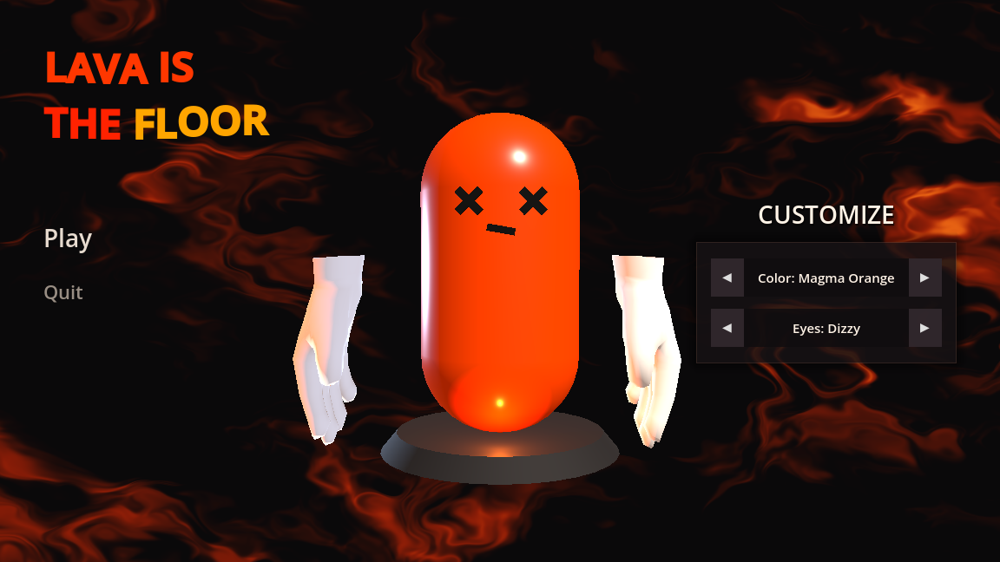

# Lava is the Floor

A fast-paced, competitive multiplayer "the floor is lava" party game built with the Godot 4 engine in GDScript.

## Overview

**Lava is the Floor** turns childhood floor-is-lava games into chaotic 3D multiplayer action. Jump, climb, and mantle between moving and spinning platforms while avoiding the molten lava below!

### Features
- **The Floor is Lava Mechanics:** A molten, burning floor with dynamic bounces, hazardous obstacles, moving platforms, and intense parkour action.
- **Bean Character Customization:** Full 3D bean customizer inspired by *Grapples Galore*. Personalize your bean with rich color palettes and 10 stylized cartoon eye styles (including the legendary *Henrik* shades, Cyclops, Inferno, and more).
- **Persistent Outfits:** Customizations are saved locally (`user://bean_customization.cfg`) and automatically synchronized across the network to all other players.
- **Multiplayer Networking:** Integrated lobby system powered by Noray relay and NAT traversal for seamless direct peer-to-peer and relay multiplayer connections.

## License

Lava is the Floor is source-available software.

You are allowed to:
- View and study the source code
- Create personal modifications and builds for private use
- Submit contributions and improvements
- Create and share non-commercial modifications for personal or community use, as long as they do not redistribute the original game, source code, or assets as a standalone project or replacement for official releases

You are not allowed to:
- Sell this project or modified versions of it
- Distribute modified or unmodified versions of the project without explicit permission from the creator
- Use the game's assets, code, or content in other projects unrelated to Lava is the Floor, or distribute them separately, without explicit permission from the creator
- Claim ownership or authorship of the project or its original content
- Attempt to bypass these restrictions by any means, including rebranding, repackaging, or redistributing the project in another form without explicit permission from the creator
- Rebrand, rename, or present the project or its contents as your own work

Contributions submitted to this project may be used, modified, and distributed as part of Lava is the Floor by the creator.

Contributors retain credit for their work but do not gain ownership rights over the project or revenue generated from it.

Contributors must only submit content that they have the right to contribute.

This software is provided "as is", without warranty of any kind.

The creator retains all rights to the project at all times, including but not limited to the rights to monetize, archive, modify, discontinue, or remove the project at any time.

Official releases of Lava is the Floor may be distributed through platforms such as Steam or itch.io. Compiling the source code for personal use is allowed, but purchasing official releases supports the creator. :)

For commercial usage, strict no.

alr bye have fun :)

everything but grinding flux and devlogs fr 😔
